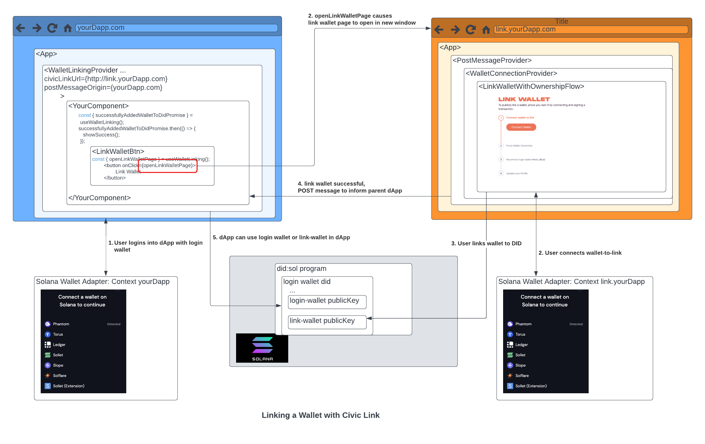

# Civic Link

This package provides the tools and UI for a dApp to orchestrate a user linking one wallet to another. The linking mechanism uses the Decentralised IDentifier Solana program, and the associated [identity.com DID toolkit libraries](https://www.npmjs.com/package/@identity.com/sol-did-client).



The orchestration works by setting up opening a new 'child' browser window where the user can connect the wallet they want to link in a separate wallet signing context, without the 'parent' dApp needing to log the user out (the [solana wallet adapter](https://solana-labs.github.io/wallet-adapter/) doesn't allow connection of multiple wallets). The child browser window is initialised with GET parameters passed from the parent dApp. When the wallet linking is finished, the child window communicates this to the parent window using the _window.postMessage_ API.

Note: the 'child' link-wallet component must be hosted in a separate application from the 'parent' dApp, alternatively, the civic-themed iframe can be referenced which is hosted at https://link.civic.me.

The Civic Link tools can be seen in action as part of [civic.me](https://civic.me/). You can try it by connecting your primary wallet and linking an additional wallet to your _civic.me_ profile (in the Settings -> Wallet menu):


For more details: [Civic Help Center - How do I link an additional wallet?](https://support.civic.com/hc/en-us/articles/7012041417111-How-do-I-link-an-additional-wallet).

## Usage

### Link-wallet app (child)
The link-wallet flow needs to run in a separately hosted application from the parent dApp and needs to implement an App like below:
```
import React from "react";
import {
  LinkWalletInputParameters,
  WalletConnectionProvider,
  LinkWalletWithOwnershipFlow,
  PostMessageProvider,
} from "@civic/civic-link";

export function LinkWalletFlow({}): React.ReactElement {
  return (
    <PostMessageProvider
    ...
    >
      <WalletConnectionProvider
        ...
      >
          <LinkWalletWithOwnershipFlow
            ...
          />
      </WalletConnectionProvider>
    </PostMessageProvider>
  );
}

```

### dApp (parent)
The parent dApp needs to trigger the opening of the child link-wallet window using the `openLinkWalletPage` function from `useWalletLinking`. When wallet linking has completed successfully, the parent dApp can react to this event by using the `successfullyAddedWalletToDidPromise` from`useWalletLinking`. Note that all the snippets below need to be wrapped in the `<WalletLinkingProvider>`./

```
<App>
  <WalletLinkingProvider>
    const { openLinkWalletPage, successfullyAddedWalletToDidPromise } = useWalletLinking();
    successfullyAddedWalletToDidPromise.then(() => {
      showSuccess();
    });
    return <button onClick={openLinkWalletPage}>
        Link Wallet
      </button>
    
  </WalletLinkingProvider>
</App>
```
